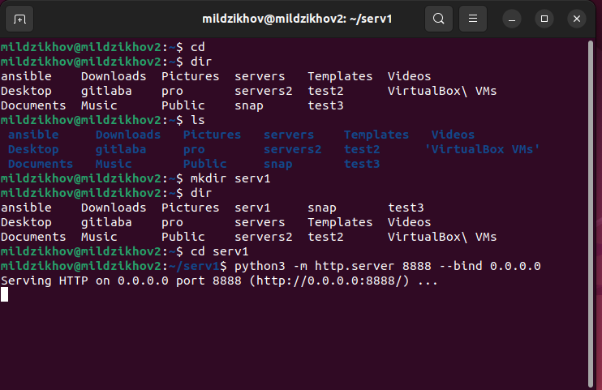

# Домашнее задание к занятию 2 «Кластеризация и балансировка нагрузки» - Мильдзихов Сергей

### Цель задания
В результате выполнения этого задания вы научитесь:

1. Настраивать балансировку с помощью HAProxy
2. Настраивать связку HAProxy + Nginx

---

### Чеклист готовности к домашнему заданию
1. Установлена операционная система Ubuntu на виртуальную машину и имеется доступ к терминалу
2. Просмотрены конфигурационные файлы, рассматриваемые на лекции, которые находятся по ссылке

---

### Задание 1

1. Запустите два simple python сервера на своей виртуальной машине на разных портах
2. Установите и настройте HAProxy, воспользуйтесь материалами к лекции по ссылке
3. Настройте балансировку Round-robin на 4 уровне.
4. На проверку направьте конфигурационный файл haproxy, скриншоты, где видно перенаправление запросов на разные серверы при обращении к HAProxy.

### Ответ

Были созданы два simple python сервера

`

`

Настройки HAProxy:

`

`

Конфигурационный файл HAProxy находится [здесь](https://github.com/mildzikhov01/2-claster/blob/main/haproxy.cfg)

---

### Задание 2

1. Запустите три simple python сервера на своей виртуальной машине на разных портах
2. Настройте балансировку Weighted Round Robin на 7 уровне, чтобы первый сервер имел вес 2, второй - 3, а третий - 4
3. HAproxy должен балансировать только тот http-трафик, который адресован домену example.local
4. На проверку направьте конфигурационный файл haproxy, скриншоты, где видно перенаправление запросов на разные серверы при обращении к HAProxy c использованием домена example.local и без него.

### Ответ

`

`

Конфигурационный файл HAProxy находится [здесь](https://github.com/mildzikhov01/2-claster/blob/main/haproxy2.cfg)
